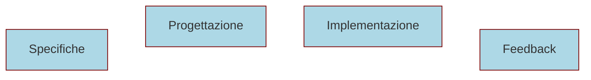
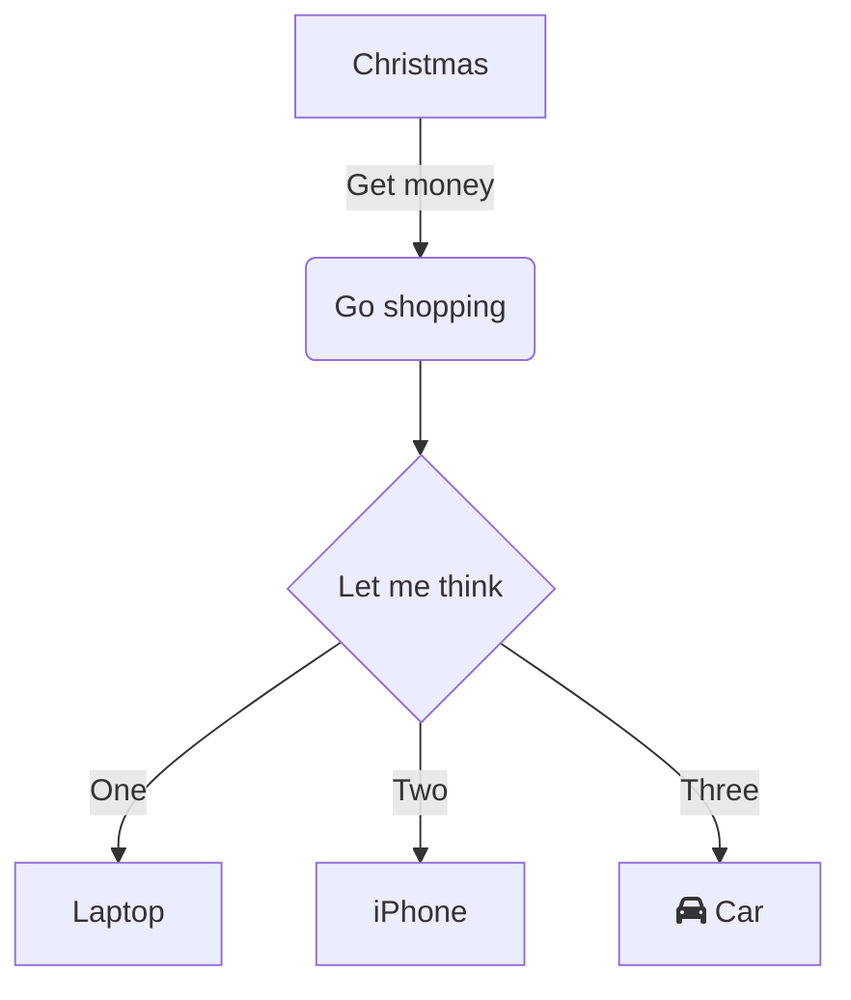

# Collaborazione Efficace tra team di sviluppo e Stakeholder
Costruire Software Funzionante  
con approccio ATDD

<!-- hidden-start -->
Nana Bianca e Schrödinger Hat si uniscono per portarvi workshop di
approfondimento sul mondo Open Source.

Il prossimo 27 Novembre, con Lorenzo Bugli, senior engineer @Fiscozen parleremo
di "Collaborazione Efficace tra Team di Sviluppo e Stakeholder: Costruire
Software Funzionante con approccio ATDD"

Nel moderno sviluppo software, la stretta collaborazione tra il team di sviluppo
e gli stakeholder è essenziale per creare soluzioni che rispondano efficacemente
ai requisiti di business. Questo talk esplora come l'Acceptance Test-Driven
Development (ATDD) possa guidare questa collaborazione, riducendo sprechi e
garantendo che il software cresca in modo funzionale e allineato alle esigenze
reali.

L'ATDD permetta al team di sviluppo e agli stakeholder di definire insieme i
requisiti sotto forma di test di accettazione, che guidano la realizzazione
tecnica e assicurano che ogni funzionalità risponda ai bisogni reali. Questo
approccio aiuti a prevenire incomprensioni a ridurre gli sprechi, concentrando
il lavoro su ciò che è essenziale e immediatamente verificabile.

Il processo test-first crea un sistema di verifica continua, garantendo che il
software funzioni correttamente e soddisfi costantemente le aspettative degli
utenti.

Con esempi pratici e casi di studio veri, i partecipanti scopriranno come a
partire da un'analisi preliminare, tutto il lavoro successivo affrontato con
l'ATDD trasformi la collaborazione tra team di sviluppo e stakeholder orientata
ai risultati e capace di produrre software di qualità che soddisfi i bisogni del
business fin dalle prime iterazioni.
<!-- hidden-end -->

---

Collaborazione Efficace  
tra team di sviluppo e <span class="fragment highlight-current-blue" data-fragment-index="2">Stakeholder</span>

---

## Stakeholder?

In questo contesto gli stakeholder sono tutti coloro che possiedono la
conoscenza da inserire all'interno del software.  
<!-- .element: class="fragment align-left" -->

I detentori della conoscenza di dominio.
<!-- .element: class="fragment align-left" -->

---

<span class="fragment highlight-current-blue" data-fragment-index="1">Collaborazione Efficace</span> 
tra team di sviluppo e <span class="fragment highlight-current-blue" data-fragment-index="0">detentori della conoscenza di dominio</span>

---

## Collaborazione efficace?

Lavorare insieme per un obiettivo comune minimizzando le energie utilizzate
nello svolgere il proprio lavoro.
<!-- .element: class="fragment" -->

---

<span class="fragment highlight-current-blue" data-fragment-index="0">
Collaborazione </span> tra team di sviluppo e detentori della conoscenza di
dominio 
<span class="fragment highlight-current-blue" data-fragment-index="0">
per <span class="fragment highlight-current-blue" data-fragment-index="1"> sviluppare software </span>
minimizzando le energie spese nello svolgere il proprio lavoro</span>

---

## Sviluppare un software


---



---

```mermaid-animation
A
A-->B B 
B-->C C
C-->D D C-->E E C-->F F
```
---

## Problemi nello sviluppo software 

Specifiche errate o incomplete
<!-- .element: class="fragment" -->

Cattiva comunicazione con gli stakeholder
<!-- .element: class="fragment" -->

---

<div class="sources">

### Fonti 

- [Wikipedia - Stakeholder](https://it.wikipedia.org/wiki/Stakeholder)
- [Zero uno web](https://www.zerounoweb.it/software/gli-stakeholder-e-il-loro-punto-di-vista/)


### Libri
<!-- .element: class="mt-1" -->

- [ATDD by Example: A Practical Guide to Acceptance Test-Driven Development](https://www.amazon.it/ATDD-Example-Practical-Acceptance-Test-Driven/dp/0321784154)

</div>
