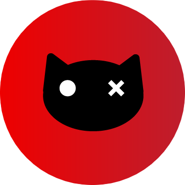
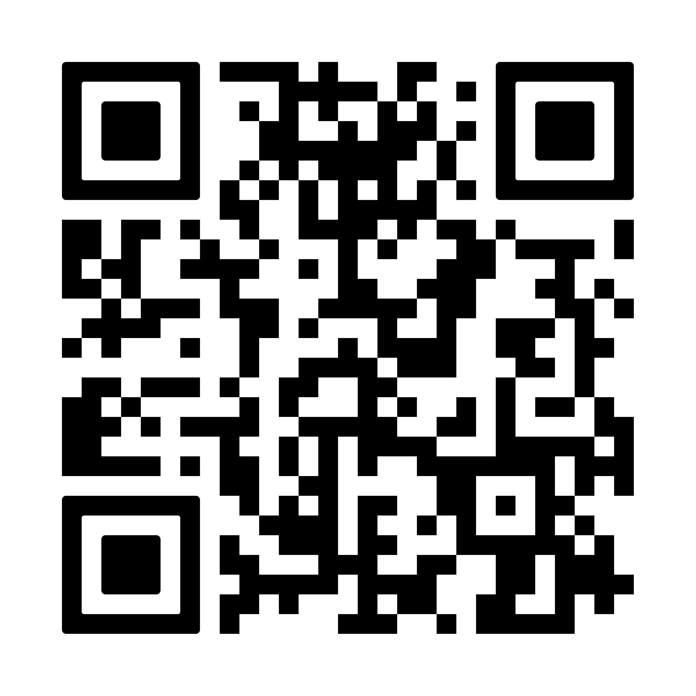
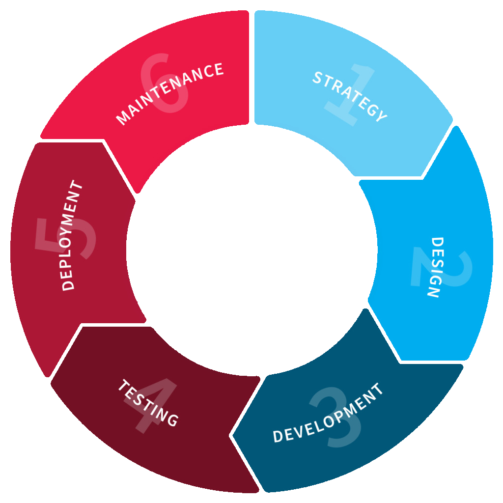
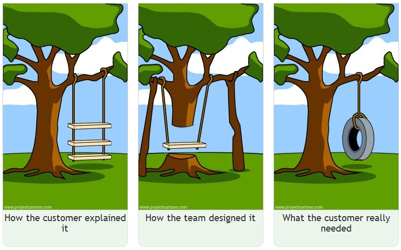
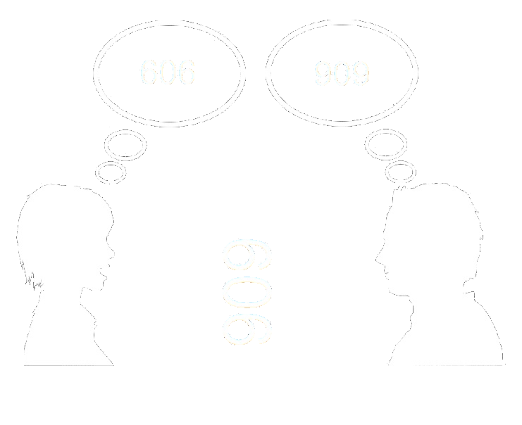
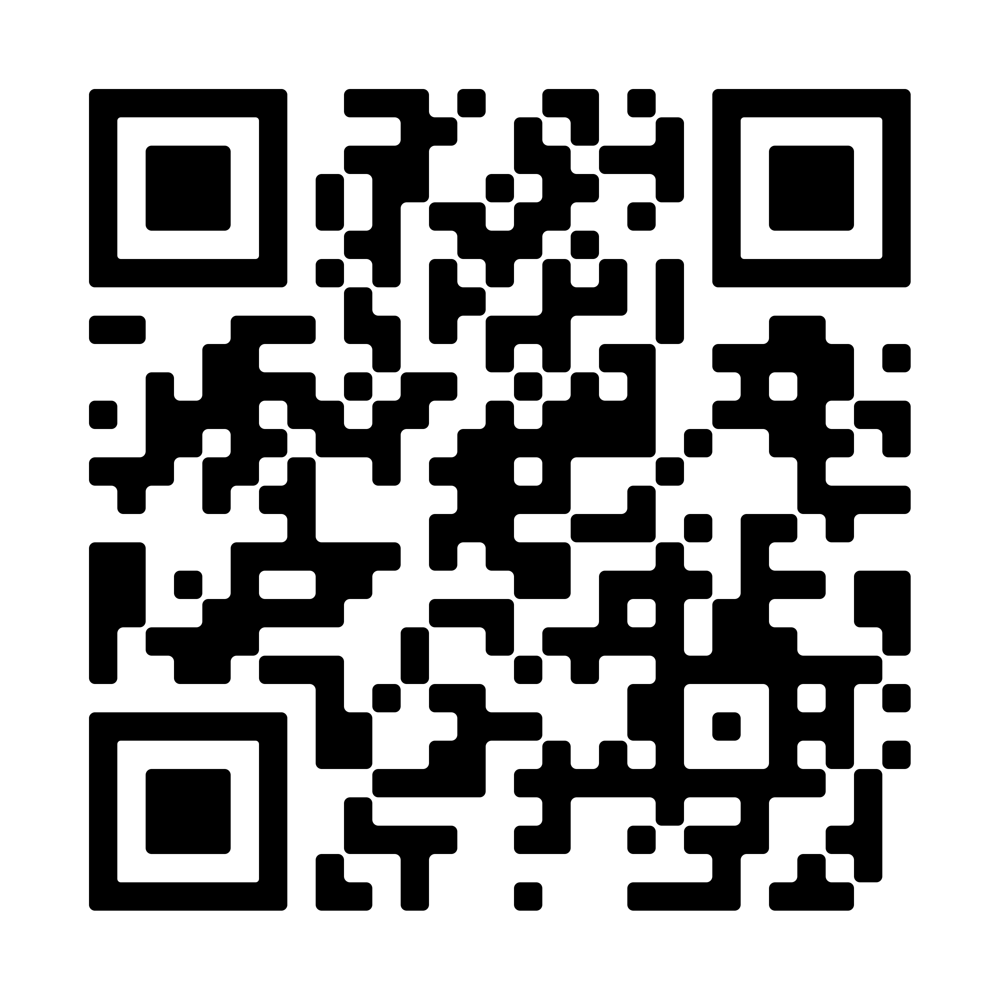

# Collaborazione Efficace tra team di sviluppo e Stakeholder
Costruire Software Funzionante  
con approccio ATDD


---

Ogni mattina Bob si sveglia

---

Bob e' uno sviluppatore freelance a cui \
viene commissionato lo sviluppo di un software gestionale per un'azienda che
produce carta.

---

Bob non sa niente di come \
si vende o si produce la carta.

---

Ma gli viene fornita una documentazione \
lunga quanto le cronache di Narnia

---

La documentazione contiene delle \
discrepanze tra varie sezioni.

---

Bob non sa da dove partire

---

Ogni mattina Alice si sveglia

---

Alice e' l'unica sviluppatrice in un'agenzia viaggi, neoassunta la scorsa
settimana e deve iniziare ad integrare il programma interno all'azienda.

---

Il software e' gia' in produzione \
ed Alice non sa come funziona 

---

Fortunatamente ha gia' costruito altre applicazioni per delle agenzie viaggi,
conosce l'argomento, deve solo capire quali sono le customizzazioni

---

Non e' presente alcuna documentazione \
sullo sviluppo del software in produzione

---

Il vecchio sviluppatore e' scappato in Brasile

---

Alice non sa da dove partire

---

Che tu sia Bob oppure Alice \
l'importante e' che tu sappia usare ATTD \
per arrivare a fine giornata

---

# Lorenzo Bugli

<div class="flex">
    <div class="w-50"></div>
    <div class="align-left mt-1 ml-1">
        Senior software engineer presso <span class="text-blue-highlight">Fiscozen</span>
        faccio parte della community di <span class="text-blue-highlight">Schroedinger Hat</span>
    </div>
</div>
<br />
<div class="flex">
    <div class="align-left">
        Schroedinger Hat e' un'associazione no profit che promuove l'opensource 
        attraverso progetti di sviluppo software ed eventi
    </div>
    <div class="w-75">
        
    </div>
</div>

---

<div class="flex">
    <div>
        <br />
        Profilo Linkedin 
    </div>
    <div>
        <br />
        Sito Schroedinger 
    </div>
</div>

---

Cosa vuol dire sviluppare un software?

---

Sviluppare un software significa \
creare un <span class="text-blue-highlight">modello computerizzato</span> \
per <span class="text-blue-highlight">risolvere</span> un <span class="text-blue-highlight">problema specifico</span>

---

## Fasi dello sviluppo software - teoria


<!-- .element: class="fragment right-col" data-fragment-index="5" -->

<br/>
<br/>

- Scrittura dei requisiti
<!-- .element: class="fragment" data-fragment-index="1" -->
- Progettazione del sistema
<!-- .element: class="fragment" data-fragment-index="2"  -->
- Implementazione del codice
<!-- .element: class="fragment" data-fragment-index="3"  -->
- Testing delle funzionalita'
<!-- .element: class="fragment" data-fragment-index="4"  -->

---

## Fasi dello sviluppo software - teoria


<!-- .element: class="right-col" -->

<br/>

Qualsiasi sia il framework di sviluppo 
le macro aree del ciclo di vita del software 
sono sempre le stesse 
<!-- .element: class="align-left" -->

---

Bella la teoria ma cosa succede poi nella pratica?

---

## Fasi dello sviluppo software - pratica



---

<br /> Capita che per problemi di comunicazione
il modello rappresentativo non rispetta i requisiti
<!-- .element: class="left-col align-left" -->


<!-- .element: class="right-col" -->

---

<span class="text-blue-highlight">Acceptance Test-Driven Development</span> 
puo' aiutare a ridurre i problemi di comunicazione collaborando alla 
<span class="text-blue-highlight">scrittura</span> parte dei 
<span class="text-blue-highlight">test</span> agli 
<span class="text-blue-highlight">stakeholder</span>

---

# Un caso reale
## Gestione documenti

---

Mario e' un dirigente di un'azienda di progettazione di <span class="text-blue-highlight">impianti industriali</span>
che ha bisogno di un <span class="text-blue-highlight">software documentale</span> che aiuti il lavoro di tutti i giorni

---

Una delle feature chiave del software e' quella di 
<span class="text-blue-highlight">associare ai documenti</span>
dei <span class="text-blue-highlight">colori</span> in base ai
<span class="text-blue-highlight">campi</span> del documento

---

I campi del documento che fanno variare il colore:
- Tipo di documento
- Stato del documento
- Firma digitale applicata

---

Specifica software scritta da Mario
```text
Il sistema deve associare a tutti i documenti firmati 
digitalmente il colore verde.  

Tutti i documenti di tipo distinte materiale devono 
essere associati al colore giallo.  

I documenti in lavorazione devono essere associati al 
colore rosso a meno che non siano di tipo disegno tecnico, 
in quel caso devono avere il colore blu.
```

Niente di strano?
<!-- .element: class="fragment" -->

Cosa succede per le distinte materiali in lavorazione?
<!-- .element: class="fragment" -->

Cosa succede per i disegni tecnici in lavorazione firmati digitalmente?
<!-- .element: class="fragment" -->

---

Bob si sente confidante e inizia a sviluppare il software

---

Dopo l'implementazione di Bob il software sembrava funzionare 
ma Mario si e' accorto che i documenti firmati digitalmente 
in lavorazione non avevano il colore rosso

---

Suona familiare?


---

Bob cambia approccio e decide di scrivere insieme a Mario
le specifiche sottoforma di test di accettazione

---

# A di ATDD

Un specifica software scritta da Mario insieme a BOB

```text[1-4|5|6]
Dato un documento 
    firmato digitalmente, 
    di qualsiasi tipo, 
    in stato di lavorazione
quando gli viene associato un colore
allora il colore associato e' il ROSSO
```

---

# Cosa e' successo?
- Il formato della specifica risulta piu' chiaro
<!-- .element: class="fragment" -->
- Il test di accettazione non fa riferimento a nessun costrutto software
<!-- .element: class="fragment" -->
- Bob e Mario hanno concordato sul comportamento del software
<!-- .element: class="fragment" -->

---

Come utilizza Bob la specifica fornita?

Parte TDD di ATDD
<!-- .element: class="fragment" -->

---

# Cos'e' TDD? 
# (Test Driven Development)

---

Test first 

code later
<!-- .element: class="fragment" -->

---

# TDD in pratica

1. Scrivere un test che fallisce
<!-- .element class="fragment" -->

2. Implementare il <span style="color: #ffaa00 ">codice minimo</span> per far
passare il test
<!-- .element class="fragment" -->

1. Rifattorizzare mantenendo i test verdi
<!-- .element class="fragment" -->

---



Repository con il codice di esempio

---


# Cos'e' TDD?
1. Scrivere un test che fallisce

```python [0-9|10-23]
@dataclass
class Documento:
    protocollo: str
    tipo: TipoDocumento
    stato: StatoDocumento
    firmato: bool

    def colore(self) -> Colors:
        pass

class ColoreDocumentoShould(TestCase):
    def test_colore_rosso(self):
        documento = Documento(
            protocollo="123",
            tipo=TipoDocumento.DISTINTA_MATERIALI,
            stato=StatoDocumento.IN_LAVORAZIONE,
            firmato=True,
        )

        self.assertEqual(
            documento.colore(), 
            Colori.ROSSO
        )
```

---

```text [1,10,15]
> python -m unittest 000_first_acceptance_test.py 
F
======================================================================
FAIL: test_colore_rosso_quando_viene_associato_dato_un_documento_firmato_digitalmente_in_stato_di_lavorazione (010_documentale.000_first_acceptance_test.ColoreDocumentoShould.test_colore_rosso_quando_viene_associato_dato_un_documento_firmato_digitalmente_in_stato_di_lavorazione)
----------------------------------------------------------------------
Traceback (most recent call last):
  File "/Users/Fiscozen/Progetti/ATTD_Talk/src/010_documentale/000_first_acceptance_test.py", line 25, in test_colore_rosso_quando_viene_associato_dato_un_documento_firmato_digitalmente_in_stato_di_lavorazione
    self.assertEqual(documento.colore(), "ROSSO")
    ~~~~~~~~~~~~~~~~^^^^^^^^^^^^^^^^^^^^^^^^^^^^^
AssertionError: None != 'ROSSO'

----------------------------------------------------------------------
Ran 1 test in 0.000s

FAILED (failures=1)
```

---

2. Implementare il codice minimo per far passare il test
```python [8-9]
@dataclass
class Documento:
    protocollo: str
    tipo: TipoDocumento
    stato: StatoDocumento
    firmato: bool

    def colore(self) -> Colors:
        return Colori.ROSSO

```

---

```text [1,4]
> python -m unittest 000_first_acceptance_test.py 
.
----------------------------------------------------------------------
Ran 1 test in 0.000s
```

---

3. Rifattorizzare mantenendo i test verdi
```python [8-11]
@dataclass
class Documento:
    protocollo: str
    tipo: TipoDocumento
    stato: StatoDocumento
    firmato: bool

    def colore(self) -> Colors:
        if self.stato == StatoDocumento.IN_LAVORAZIONE \
            and self.firmato:
            return Colori.ROSSO
```

---

```text [1,4]
> python -m unittest 000_first_acceptance_test.py 
.
----------------------------------------------------------------------
Ran 1 test in 0.000s
```

---

```python 
def test_colore_rosso(self):
    documento = Documento(
        protocollo="123",
        tipo=TipoDocumento.DISTINTA_MATERIALI,
        stato=StatoDocumento.IN_LAVORAZIONE,
        firmato=True,
    )

    self.assertEqual(documento.colore(), Colori.ROSSO)
```
```python 
def colore(self) -> Colors:
    if self.stato == StatoDocumento.IN_LAVORAZIONE \
        and self.firmato:
        return Colori.ROSSO
```
```text [1,4]
> python -m unittest 000_first_acceptance_test.py 
.
----------------------------------------------------------------------
Ran 1 test in 0.000s
```

---

# Qual'e' la fase piu' importante?

1. Scrivere un test che fallisce
<!-- .element class="fragment fade-out" data-fragment-index="2" -->

2. Implementare il <span style="color: #ffaa00 ">codice minimo</span> per far
passare il test

1. Rifattorizzare mantenendo i test verdi
<!-- .element class="fragment fade-out" data-fragment-index="2" -->

---

# La fase 2
```python 
    def colore(self) -> Colors:
        return Colori.ROSSO
```

<br>

- Chiude il binding test-codice, \
crea un legame tra il test ed il codice scritto.
<!-- .element: class="fragment" -->
- Verifica che il test sia inerente al comportamento corretto
<!-- .element: class="fragment" -->

---

TODO: 

---

Conclusioni

- Abbiamo visto come scrivere un test di accettazione
- Abbiamo visto come utilizzare i test per scrivere il software

---