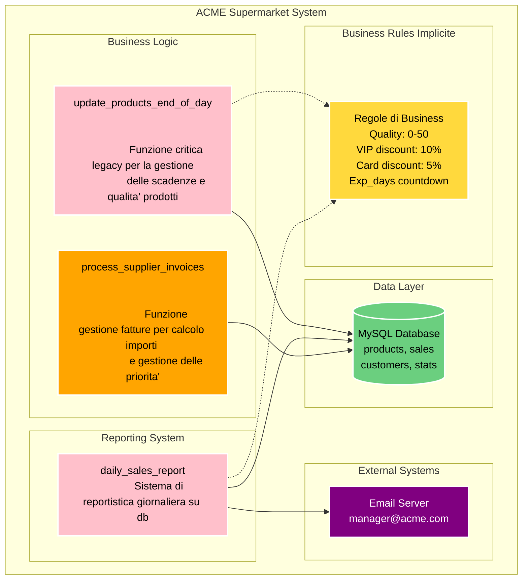

# From Zero to Tested


Come aggiungere test a un progetto esistente
https://buglil.github.io/Talks/from-zero-to-tested/#/

---

Come ci si trova immischiati <br/>
un progetto privo di test?

---

## Lunedì mattina ore 9:00 - Il briefing

---

"Buongiorno Lorenzo,  <br/>
il nostro cliente `Acme.Corp` è un supermercato con un gestionale custom. 
Vogliono una `nuova funzionalità` entro questo `venerdì`!
L'azienda che lo ha sviluppato è `fallita` e dobbiamo assolutamente occuparcene noi!"
<!-- .element class="align-left" -->

---

"...occuparcene noi!..."

---

## Situazione rosea

- Conoscenza del codice pari a zero 
<!-- .element class="fragment align-left" -->
- Zero test, zero documentazione
<!-- .element class="fragment" -->
- Non so come funziona il programma
<!-- .element class="fragment" -->

---

## Il mio primo pensiero?

---


---

## Il secondo pensiero

---

Cos'e' che devo fare esattamente?

---

## 12 meetings later...

---

## Il contesto

- Tutti i prodotti hanno una proprietà che 
  indica quanti `giorni` mancano alla `data di scadenza`.

- Tutti i prodotti hanno una proprietà che 
  denota il `valore` dell'articolo

---

## Il contesto

- Alla `fine di ogni giornata` il sistema `decrementa`
  entrambe le proprietà per ogni prodotto 

- Alcuni prodotti hanno `regole speciali`, come le
  `promozioni speciali` che hanno regole personalizzate

---

## Maggiori dettagli

"Metteremo in vendita una nuova categoria di prodotti, i `prodotti biologici`.
Questi prodotti perdono qualità più velocemente ogni giorno. Dobbiamo
aggiornare il sistema per gestire delle `nuove regole personalizzate` e
aggiungere una voce per il report delle vendite giornaliere.
<!-- .element class="align-left" -->

<!-- C'e' un altra funzionalita' da integrare ma stiamo ancora definendo i dettagli."-->

---

Ho concluso la giornata portandomi il `codice in locale` con un `backup`
del `database` per poter iniziare a guardare il codice e sopratutto `provare`
il `software` .
<!-- .element class="align-left" -->

---

Alla fine la richiesta del cliente e' semplice, no?

---

Ingenuo...

---

## Martedi' 

---

## Un primo sguardo al codice

---

Prendiamo un pezzo a caso del codice

---


---

```python
def process_supplier_invoices():
    global connection, cursor, total_amount, email_server
    cursor.execute("SELECT * FROM supplier_invoices WHERE status != 'PROCESSED'")
    invoices = cursor.fetchall()
    total_amount = 0.0
    urgent_count = 0; vip_discount = 0; report_text = ""
    
    for inv in invoices:
        if inv[8] == 1:  # Fattura urgente
            cursor.execute("UPDATE supplier_invoices SET priority = 'HIGH' WHERE id = " + str(inv[0]))
            if inv[4] > 5000:  # Importo alto
                            cursor.execute("SELECT vip_status FROM suppliers WHERE id = " + str(inv[2]))
                            supplier = cursor.fetchone()
                            if supplier and supplier[0] == 1:  # Fornitore VIP
                                discounted = inv[5] * 0.98
                                vip_discount += inv[5] - discounted
                                total_amount += discounted
                                query = str(inv[0]) + ", " + str(vip_discount) + ", '" + str(datetime.now()) + "'"
                                cursor.execute("INSERT INTO vip_discounts VALUES (" + query + ")")
            else:
                            total_amount += inv[5]
        else:
            total_amount += inv[5]
            
        cursor.execute("UPDATE supplier_invoices SET status = 'PROCESSED' WHERE id = " + str(inv[0]))
    
    final_report = "FATTURE FORNITORI " + str(datetime.now().day) + "/" + str(datetime.now().month) + "\n"
    email_server.sendmail("finance@acme.com", final_report)
    f = open("/tmp/suppliers_" + str(datetime.now().date()) + ".txt", "w")
    f.write(final_report)
    f.close()
    connection.commit()
    
    if urgent_count > 5:
        return False, "TROPPI URGENTI", urgent_count
    else:
        return True, final_report, total_amount
```
<!-- .element class="fullscreen"  -->

---


---

## Caratteristiche principali del codice

- Wall of code unico `non strutturato`
<!-- .element class="fragment" -->

- Impossibile da toccare `senza rompere` qualcosa
<!-- .element class="fragment" -->

---

Quella modifica che doveva essere fatta <br/>
in `mezza giornata` non era possibile

---

Come si affronta un mostro del genere?

---

Si capisce la `funzionalita' alto livello` del sistema
<!-- .element class="align-left" -->

Si ricerca nel codice `dove` e `come` le funzionalita' sono state implementate
<!-- .element class="fragment align-left" -->

---


Lo scopo e' comprendere le `dipendenze` tra i componenti e `trovare`
i punti impattati da un eventuale cambiamento
<!-- .element class="align-left" -->

Non si scrive codice, si `studia` quello esistente
<!-- .element class="fragment align-left" -->

Si cerca di capire come ha `ragionato` il programmatore 
<!-- .element class="fragment align-left" -->

---


<!-- .element class="fullscreen"  -->

---

Sezioni trovate

- La funzione `update_products_end_of_day`
  gestisce le scadenze dei prodotti
<!-- .element class="fragment" -->

- La funzione `daily_sales_report`
  genera il report giornaliero delle vendite
<!-- .element class="fragment" -->

---

Osserviamo il codice della funzione `update_products_end_of_day`

---

```python
def update_products_end_of_day():
  cursor.execute("SELECT id, name, exp_days, quality FROM products")
  for item in cursor.fetchall():
    if item.name != "Formaggio Brie" and item.name != "Promozione Speciale":
      if item.quality > 0:
        if item.name != "Miele":
          item.quality = item.quality - 1
    else:
      if item.quality < 50:
        item.quality = item.quality + 1
        if item.name == "Promozione Speciale":
          if item.exp_days < 11:
            if item.quality < 50:
                            item.quality = item.quality + 1
          if item.exp_days < 6:
            if item.quality < 50:
                            item.quality = item.quality + 1
    if item.name != "Miele":
      item.exp_days = item.exp_days - 1
    if item.exp_days < 0:
      if item.name != "Formaggio Brie":
        if item.name != "Promozione Speciale":
          if item.quality > 0:
            if item.name != "Miele":
                            item.quality = item.quality - 1
        else:
          item.quality = item.quality - item.quality
      else:
        if item.quality < 50:
          item.quality = item.quality + 1
  for item in items:
    cursor.execute(
      "UPDATE products SET exp_days = ?, quality = ? WHERE id = ?",
      (item.exp_days, item.quality, item.id)
    )
  connection.commit()
```
<!-- .element class="fullscreen"  -->

---


```python[|2|3-6|7-15]
def update_products_end_of_day():
  cursor.execute("SELECT id, name, exp_days, quality FROM products")

  for item in cursor.fetchall():
    # .... condizioni varie

  for item in items:
    cursor.execute(
      "UPDATE products SET exp_days = ?, quality = ? WHERE id = ?",
      (item.exp_days, item.quality, item.id)
    )
  connection.commit()
```

---


Osserviamo il codice della funzione `update_products_end_of_day`

---

```python
def daily_sales_report():
    global connection, cursor, total_sales, yesterday_date, email_server
    cursor.execute("SELECT * FROM sales WHERE date = '" + str(datetime.now().date()) + "'")
    sales = cursor.fetchall()
    total_sales = 0.0
    cash_sales = 0; card_sales = 0; discount_amount = 0
    report_text = ""
    cursor.execute("SELECT COUNT(*) FROM customers WHERE active = 1")
    active_customers = cursor.fetchone()[0]
    
    for s in sales:
        total_sales += s[3]
        report_text = report_text + "Vendita ID: " + str(s[0]) + " - "
        if s[4] == 1:
            cursor.execute("UPDATE customer_stats SET visits = visits + 1 WHERE id = " + str(s[7]))
            cash_sales += s[3]
            report_text = report_text + "PICCOLO - "
        else:
            report_text = report_text + "CARTA - "
            card_sales += s[3] * 0.95
            discount_amount += s[3] * 0.05
            now = datetime.now()
            cursor.execute("INSERT INTO promotions_used VALUES (" + str(s[0]) + ", 'CARD_DISCOUNT', '" + str(now) + "')")
            report_text = report_text + "SCONTO CARTA 5% - "
        report_text = report_text + "€" + str(s[3]) + "\n"
    
    report_text = "ACME CORP - " + "REPORT " + "VENDITE " + "DEL " + str(datetime.now().day) 
    report_text += "/" + str(datetime.now().month) + "/" + str(datetime.now().year) 
    report_text += " alle " + str(datetime.now().hour) + ":" + str(datetime.now().minute) 
    report_text = report_text + "TOTALE" + ": " + "€" + str(total_sales) + "\n"
    report_text = report_text + "CLIENTI" + " " + "ATTIVI" + ": " + str(active_customers) + "\n"
    
    email_server.sendmail("manager@acme.com", report_text)
    cursor.execute("INSERT INTO email_log VALUES ('" + str(datetime.now()) + "', 'manager@acme.com', 'REPORT_SENT')")
    f = open("/tmp/sales_" + str(datetime.now().date()) + ".txt", "w")
    f.write(report_text)
    f.close()
    cursor.execute("UPDATE stats SET last_report = '" + str(datetime.now()) + "'")
    cursor.execute("UPDATE stats SET total_reports = total_reports + 1")
    connection.commit()
```
<!-- .element class="fullscreen"  -->

---

```python
def daily_sales_report():
    global connection, cursor, total_sales, yesterday_date, email_server
    # ...
```

---

```python[8,16|22]
def daily_sales_report():
    # ...
    
    for s in sales:
        total_sales += s[3]
        report_text = report_text + "Vendita ID: " + str(s[0]) + " - "
        if s[4] == 1:
            cursor.execute("UPDATE customer_stats SET visits = visits + 1 WHERE id = " + str(s[7]))
            cash_sales += s[3]
            report_text = report_text + "PICCOLO - "
        else:
            report_text = report_text + "CARTA - "
            card_sales += s[3] * 0.95
            discount_amount += s[3] * 0.05
            now = datetime.now()
            cursor.execute("INSERT INTO promotions_used VALUES (" + str(s[0]) + ", 'CARD_DISCOUNT', '" + str(now) + "')")
            report_text = report_text + "SCONTO CARTA 5% - "
        report_text = report_text + "€" + str(s[3]) + "\n"
    
    # ...

    email_server.sendmail("manager@acme.com", report_text)
    cursor.execute("INSERT INTO email_log VALUES ('" + str(datetime.now()) + "', 'manager@acme.com', 'REPORT_SENT')")
    f = open("/tmp/sales_" + str(datetime.now().date()) + ".txt", "w")
    f.write(report_text)
    f.close()
    cursor.execute("UPDATE stats SET last_report = '" + str(datetime.now()) + "'")
    cursor.execute("UPDATE stats SET total_reports = total_reports + 1")
    connection.commit()
```
<!-- .element class="fullscreen"  -->
---

## Mercoledi'

---

## Il primo test

---

L'analisi del codice ha permesso di identificare le parti da modificare
adesso si costruiscono i primi `test di caratterizzazione`
<!-- .element class="align-left" -->

---


## Characterization tests

Sono test che verificano il `comportamento esistente` del sistema
non di come dovrebbe funzionare
<!-- .element class="align-left" -->

Hanno lo scopo di creare uno `snapshot funzionale`
per poter cambiare il codice in sicurezza
<!-- .element class="fragment align-left" -->

---

## Characterization tests

Sono dei test `ad alto livello`, spesso `end-to-end` oppure `di integrazione`
<!-- .element class="align-left" -->

Testano blocchi di codice `grandi` oppure `sezioni intere` del sistema
<!-- .element class="fragment align-left" -->

---


---

## Characterization tests vs TDD

- Si scrivono dei test `verdi`, senza toccare la funzionalita'
<!-- .element class="fragment align-left" -->

- Si `rifattorizza` il codice mantenendo i test verdi
<!-- .element class="fragment align-left" -->

- Si aggiunge la `nuova funzionalita'` mantenendo i test verdi
<!-- .element class="fragment align-left" -->

---

```python
def update_products_end_of_day():
  cursor.execute("SELECT id, name, exp_days, quality FROM products")
  for item in cursor.fetchall():
    if item.name != "Formaggio Brie" and item.name != "Promozione Speciale":
      if item.quality > 0:
        if item.name != "Miele":
          item.quality = item.quality - 1
    else:
      if item.quality < 50:
        item.quality = item.quality + 1
        if item.name == "Promozione Speciale":
          if item.exp_days < 11:
            if item.quality < 50:
                            item.quality = item.quality + 1
          if item.exp_days < 6:
            if item.quality < 50:
                            item.quality = item.quality + 1
    if item.name != "Miele":
      item.exp_days = item.exp_days - 1
    if item.exp_days < 0:
      if item.name != "Formaggio Brie":
        if item.name != "Promozione Speciale":
          if item.quality > 0:
            if item.name != "Miele":
                            item.quality = item.quality - 1
        else:
          item.quality = item.quality - item.quality
      else:
        if item.quality < 50:
          item.quality = item.quality + 1
  for item in items:
    cursor.execute(
      "UPDATE products SET exp_days = ?, quality = ? WHERE id = ?",
      (item.exp_days, item.quality, item.id)
    )
  connection.commit()
```
<!-- .element class="fullscreen"  -->

---
TODO: CONTINUE HERE

---

## Rifattorizzazione

---


```python
def update_products_end_of_day():
  cursor.execute("SELECT id, name, exp_days, quality FROM products")

  for item in cursor.fetchall():
    # .... condizioni varie

  for item in items:
    cursor.execute(
      "UPDATE products SET exp_days = ?, quality = ? WHERE id = ?",
      (item.exp_days, item.quality, item.id)
    )
  connection.commit()
```

--- 

Toccare il codice senza `characterization tests` e' pericoloso, 
va fatto con `cautela` e `molta attenzione`

---


## Giovedi'

---

Implementazione della funzionalita'

---

<!-- Non toccare questa parte -->

## Venerdi' 

---

## La conclusione

---

## Com'e' andata a finire?

- Consegnate tutte le modifiche
<!-- .element class="fragment" -->

- Zero bug aggiunti
<!-- .element class="fragment" -->

- Batteria di test automatici per modifiche future
<!-- .element class="fragment" -->

---

Cliente molto soddisfatto!

---

Il mio capo ha avuto un aumento!

---

Io una pacca sulla spalla

---

Ma sono ugualmente soddisfatto...

---

Quella sfida ha portato ad un `framework` utile 
per `combattere` codice `legacy privo di test` <br>
in decine di occasioni
<!-- .element class="align-left" -->

---

... in ogni caso

---


---


# Grazie!


Lorenzo Bugli - @BugliL
<!-- .element class="fragment" -->

---

# Riferimenti

- [Gilded Rose Kata](https://github.com/NotMyself/GildedRose)
- Working Effectively with Legacy Code <br/>
  *Michael Feathers*

- Refactoring: Improving the Design of Existing Code <br/>
  *Martin Fowler*

