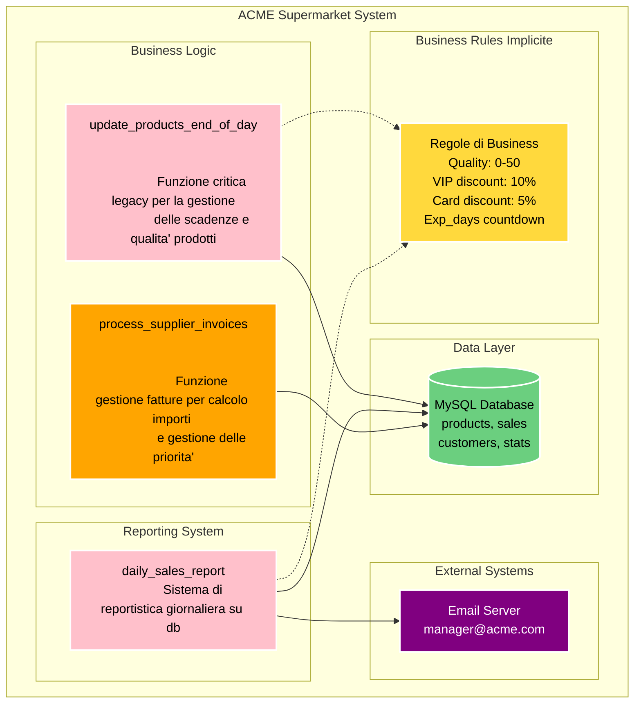
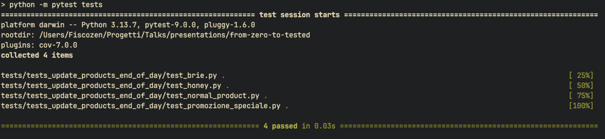
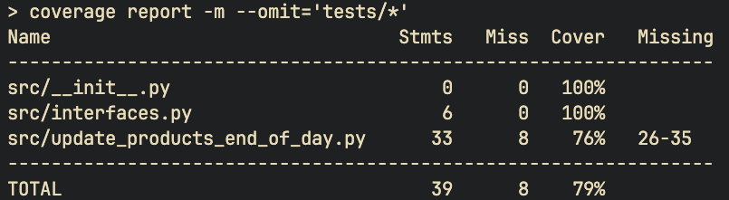
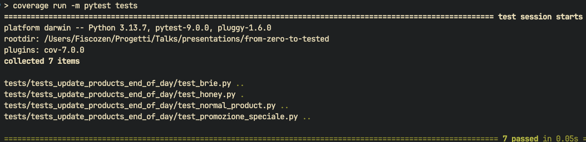
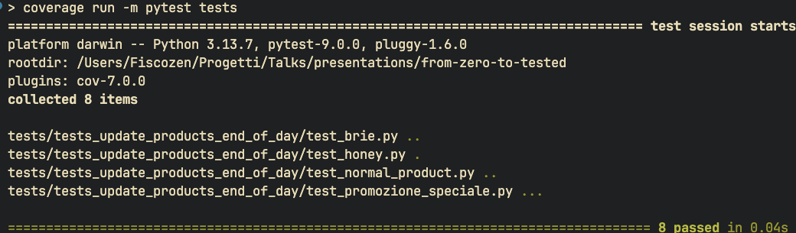
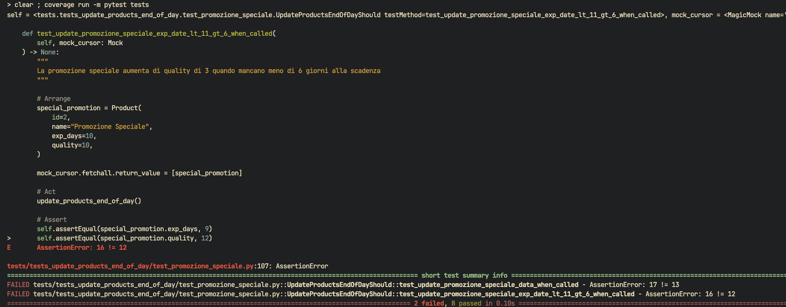

# From Zero to Tested


Come aggiungere test a un progetto esistente
https://buglil.github.io/Talks/from-zero-to-tested/#/

---

Come ci si trova immischiati <br/>
un progetto privo di test?

---

## Lunedì mattina ore 9:00 - Il briefing

---

"Buongiorno Lorenzo,  <br/>
il nostro cliente `Acme.Corp` è un supermercato con un gestionale custom. 
Vogliono una `nuova funzionalità` entro questo `venerdì`!
L'azienda che lo ha sviluppato è `fallita` e dobbiamo assolutamente occuparcene noi!"
<!-- .element class="align-left" -->

---

"...occuparcene noi!..."

---

## Situazione rosea

- Conoscenza del codice pari a zero 
<!-- .element class="fragment align-left" -->
- Zero test, zero documentazione
<!-- .element class="fragment" -->
- Non so come funziona il programma
<!-- .element class="fragment" -->

---

## Il mio primo pensiero?

---


---

## Il secondo pensiero

---

Cos'e' che devo fare esattamente?

---

## 12 meetings later...

---

## Il contesto

- Tutti i prodotti hanno una proprietà che 
  indica quanti `giorni` mancano alla `data di scadenza`.

- Tutti i prodotti hanno una proprietà che 
  denota il `valore` dell'articolo

---

## Il contesto

- Alla `fine di ogni giornata` il sistema `decrementa`
  entrambe le proprietà per ogni prodotto 

- Alcuni prodotti hanno `regole speciali`, come le
  `promozioni` che hanno regole personalizzate

---

## Maggiori dettagli

"Metteremo in vendita una nuova categoria di prodotti, i `Lenticchie biologiche`.
Questi prodotti perdono qualità più velocemente ogni giorno. Dobbiamo
aggiornare il sistema per gestire delle `nuove regole personalizzate` 
<!-- .element class="align-left" -->

---

Alla fine la richiesta del cliente e' semplice, no?

---

Ingenuo...

---

Ho concluso la giornata portandomi il `codice in locale` con un `backup`
del `database` per poter iniziare a guardare il codice e sopratutto `provare`
il `software` .
<!-- .element class="align-left" -->

---

## Martedi' 
## 3gg alla scadenza

---

Prendiamo un pezzo a caso del codice

---


---

```python[]
def process_supplier_invoices():
    global connection, cursor, total_amount, email_server
    cursor.execute("SELECT * FROM supplier_invoices WHERE status != 'PROCESSED'")
    invoices = cursor.fetchall()
    total_amount = 0.0
    urgent_count = 0; vip_discount = 0; report_text = ""
    
    for inv in invoices:
        if inv[8] == 1:  # Fattura urgente
            cursor.execute("UPDATE supplier_invoices SET priority = 'HIGH' WHERE id = " + str(inv[0]))
            if inv[4] > 5000:  # Importo alto
                            cursor.execute("SELECT vip_status FROM suppliers WHERE id = " + str(inv[2]))
                            supplier = cursor.fetchone()
                            if supplier and supplier[0] == 1:  # Fornitore VIP
                                discounted = inv[5] * 0.98
                                vip_discount += inv[5] - discounted
                                total_amount += discounted
                                query = str(inv[0]) + ", " + str(vip_discount) + ", '" + str(datetime.now()) + "'"
                                cursor.execute("INSERT INTO vip_discounts VALUES (" + query + ")")
            else:
                            total_amount += inv[5]
        else:
            total_amount += inv[5]
            
        cursor.execute("UPDATE supplier_invoices SET status = 'PROCESSED' WHERE id = " + str(inv[0]))
    
    final_report = "FATTURE FORNITORI " + str(datetime.now().day) + "/" + str(datetime.now().month) + "\n"
    email_server.sendmail("finance@acme.com", final_report)
    f = open("/tmp/suppliers_" + str(datetime.now().date()) + ".txt", "w")
    f.write(final_report)
    f.close()
    connection.commit()
    
    if urgent_count > 5:
        return False, "TROPPI URGENTI", urgent_count
    else:
        return True, final_report, total_amount
```
<!-- .element class="fullscreen"  -->

---


---

## Caratteristiche principali del codice

- Wall of code unico `non strutturato`
<!-- .element class="fragment" -->

- Impossibile da toccare `senza rompere` qualcosa
<!-- .element class="fragment" -->

---

Quella modifica che doveva essere fatta <br/>
in `mezza giornata` non era possibile

---

Come si affronta un mostro del genere?

---

Si capisce la `funzionalita' alto livello` del sistema anche provando 
fisicamente l'applicazione
<!-- .element class="align-left" -->

Si ricerca nel codice `dove` e `come` le funzionalita' sono state implementate
<!-- .element class="fragment align-left" -->

---


Lo scopo e' comprendere le `dipendenze` tra i componenti e `trovare`
i punti impattati da un eventuale cambiamento
<!-- .element class="align-left" -->

Non si scrive codice, si `studia` quello esistente
<!-- .element class="fragment align-left" -->

Si cerca di capire come ha `ragionato` il programmatore 
<!-- .element class="fragment align-left" -->

---


<!-- .element class="fullscreen"  -->

---

Sezioni trovate

La funzione `update_products_end_of_day`
gestisce le scadenze dei prodotti
<!-- .element class="fragment align-left" -->

---

Osserviamo il codice della funzione `update_products_end_of_day`

---

```python[]
def update_products_end_of_day():
  cursor.execute("SELECT id, name, exp_days, quality FROM products")
  items = cursor.fetchall()
  for item in items:
    if item.name != "Formaggio Brie" and item.name != "Promozione Speciale":
      if item.quality > 0:
        if item.name != "Miele":
          item.quality = item.quality - 1
    else:
      if item.quality < 50:
        item.quality = item.quality + 1
        if item.name == "Promozione Speciale":
          if item.exp_days < 11:
            if item.quality < 50:
                            item.quality = item.quality + 1
          if item.exp_days < 6:
            if item.quality < 50:
                            item.quality = item.quality + 1
    if item.name != "Miele":
      item.exp_days = item.exp_days - 1
    if item.exp_days < 0:
      if item.name != "Formaggio Brie":
        if item.name != "Promozione Speciale":
          if item.quality > 0:
            if item.name != "Miele":
                            item.quality = item.quality - 1
        else:
          item.quality = item.quality - item.quality
      else:
        if item.quality < 50:
          item.quality = item.quality + 1
  for item in items:
    cursor.execute(
      "UPDATE products SET exp_days = ?, quality = ? WHERE id = ?",
      (item.exp_days, item.quality, item.id)
    )
  connection.commit()
```
<!-- .element class="fullscreen"  -->

---


---

L'analisi del codice porta a identificare la funzione critica 
da modificare ma ormai si e' fatta sera
<!-- .element class="align-left"  -->

---

## Mercoledi' 
## 2gg alla scadenza

---

Capito il punto in cui intervenire, come si va avanti?

---

Va costruita una `rete di sicurezza` per modificare il codice dell'applicazione
<!-- .element class="align-left"  -->

Una `batteria di test` che rappresenta le funzionalita' del programma
<!-- .element class="fragment align-left"  -->

---

Ogni modifica al codice puo' `rompere qualcosa`, ma se si verifica il 
comportamento del codice con i test si controlla se tutto funziona  `come dovrebbe`
<!-- .element class="align-left"  -->

---

## Characterization tests

---

## Characterization tests

Sono test che verificano il `comportamento attuale` 
<!-- .element class="align-left" -->

Hanno lo scopo di creare uno `snapshot funzionale` del sistema
<!-- .element class="fragment align-left" -->

---

## Characterization tests

Sono dei test `ad alto livello`, spesso `end-to-end` oppure `d'integrazione`
<!-- .element class="align-left" -->

Testano blocchi di codice `grandi` oppure `sezioni intere` del sistema
<!-- .element class="fragment align-left" -->

---


---

## Characterization tests - process

- Si scrivono dei test `verdi`, senza toccare la funzionalita'
<!-- .element class="fragment align-left" -->

- Si `rifattorizza` il codice mantenendo i test `verdi`
<!-- .element class="fragment align-left" -->

- Si aggiunge la `nuova funzionalita'` usando il TDD
<!-- .element class="fragment align-left" -->

---

```python[|3,4,33-37|5-32]
def update_products_end_of_day():
  cursor.execute("SELECT id, name, exp_days, quality FROM products")
  items = cursor.fetchall()
  for item in items:
    if item.name != "Formaggio Brie" and item.name != "Promozione Speciale":
      if item.quality > 0:
        if item.name != "Miele":
          item.quality = item.quality - 1
    else:
      if item.quality < 50:
        item.quality = item.quality + 1
        if item.name == "Promozione Speciale":
          if item.exp_days < 11:
            if item.quality < 50:
                            item.quality = item.quality + 1
          if item.exp_days < 6:
            if item.quality < 50:
                            item.quality = item.quality + 1
    if item.name != "Miele":
      item.exp_days = item.exp_days - 1
    if item.exp_days < 0:
      if item.name != "Formaggio Brie":
        if item.name != "Promozione Speciale":
          if item.quality > 0:
            if item.name != "Miele":
                            item.quality = item.quality - 1
        else:
          item.quality = item.quality - item.quality
      else:
        if item.quality < 50:
          item.quality = item.quality + 1
  for item in items:
    cursor.execute(
      "UPDATE products SET exp_days = ?, quality = ? WHERE id = ?",
      (item.exp_days, item.quality, item.id)
    )
  connection.commit()
```
<!-- .element class="fullscreen"  -->

---


```python[|2-3|4-6|7-20]
def update_products_end_of_day():
  cursor.execute("SELECT id, name, exp_days, quality FROM products")
  items = cursor.fetchall()

  for item in items:
    # .... condizioni varie

  for item in items:
    cursor.execute(
      "UPDATE products SET exp_days = ?, quality = ? WHERE id = ?",
      (item.exp_days, item.quality, item.id)
    )
  connection.commit()
```

---

Come si testa del codice `accoppiato` cosi' tanto al db?

---

I mock sono nostri amici

---

TODO: Cos'e' un mock

---

TODO: mock vs stub vs fake

---

TODO: esempio di test con mock - product base


---

TODO: esempio di run dei test

---

Non deve essere toccato il codice ma solo `eseguito` per
validare l'implementazione dei `test`
<!-- .element class="align-left"  -->

---

I `test` diventano il `codice da scrivere`
<!-- .element class="align-left fragment"  -->

Il `codice` diventa la `sorgente di verita'`
<!-- .element class="align-left fragment"  -->

---

TODO: esempio di test con mock - miele

---

TODO: esempio di test con mock - formaggio brie

---

TODO: esempio di test con mock - promozione speciale

---



---

Quando ci si ferma nello scrivere i test?

---

TODO: cos'e' la coverage

---

TODO: come sfruttare la metrica

---

## Coverage run


---

## Report di coverage 



---

```python[|3]
def update_products_end_of_day():
    # ... 
    if item.exp_days < 0:
      if item.name != "Formaggio Brie":
        if item.name != "Promozione Speciale":
          if item.quality > 0:
            if item.name != "Miele":
                            item.quality = item.quality - 1
        else:
          item.quality = item.quality - item.quality
      else:
        if item.quality < 50:
          item.quality = item.quality + 1
    # ...
```
<!-- .element class=""  -->

---

TODO: test per expired normal product

---

TODO: test per expired brie product

---


---

```python[|10]
def update_products_end_of_day():
    # ... 
    if item.exp_days < 0:
      if item.name != "Formaggio Brie":
        if item.name != "Promozione Speciale":
          if item.quality > 0:
            if item.name != "Miele":
                            item.quality = item.quality - 1
        else:
          item.quality = item.quality - item.quality
      else:
        if item.quality < 50:
          item.quality = item.quality + 1
    # ...
```
<!-- .element class=""  -->
---

TODO: test scadenza promozione speciale 6 gg

---
TODO: test scadenza promozione speciale 11 gg

---



---


---

Coverage al 100% del metodo `update_products_end_of_day`

---

TODO: localizzato edge case mancante > 50

---

TODO: test qualità oltre 50 - test_update_promozione_speciale_quality_max_50_when_called

---



---

100% di coverage non vuol dire 100% di sicurezza

---


---

Il buon senso e capire gli `edge case` sono fondamentali

---

## E ora?

---

Si rifattorizza!

---


```python
def update_products_end_of_day():
  cursor.execute("SELECT id, name, exp_days, quality FROM products")
  items = cursor.fetchall():

  for item in items:
    # .... condizioni varie

  for item in items:
    cursor.execute(
      "UPDATE products SET exp_days = ?, quality = ? WHERE id = ?",
      (item.exp_days, item.quality, item.id)
    )
  connection.commit()
```
<!-- .element class=""  -->

---

```python[]
if item.name != "Formaggio Brie" and item.name != "Promozione Speciale":
    if item.quality > 0:
        if item.name != "Miele":
            item.quality = item.quality - 1
else:
    if item.quality < 50:
        item.quality = item.quality + 1
        if item.name == "Promozione Speciale":
            if item.exp_days < 11:
                if item.quality < 50:
                    item.quality = item.quality + 1
            if item.exp_days < 6:
                if item.quality < 50:
                    item.quality = item.quality + 1
if item.name != "Miele":
    item.exp_days = item.exp_days - 1
if item.exp_days < 0:
    if item.name != "Formaggio Brie":
        if item.name != "Promozione Speciale":
            if item.quality > 0:
                if item.name != "Miele":
                    item.quality = item.quality - 1
        else:
            item.quality = item.quality - item.quality
    else:
        if item.quality < 50:
            item.quality = item.quality + 1
```
<!-- .element class="fullscreen fontsize-small"   -->

---


---

```python[]
if item.name != "Formaggio Brie" and item.name != "Promozione Speciale":
    if item.quality > 0:
        if item.name != "Miele":
            item.quality = item.quality - 1

if item.name == "Formaggio Brie":
    if item.quality < 50:
        item.quality = item.quality + 1
        if item.name == "Promozione Speciale":
            if item.exp_days < 11:
                if item.quality < 50:
                    item.quality = item.quality + 1
            if item.exp_days < 6:
                if item.quality < 50:
                    item.quality = item.quality + 1

if item.name == "Promozione Speciale":
    if item.quality < 50:
        item.quality = item.quality + 1
        if item.name == "Promozione Speciale":
            if item.exp_days < 11:
                if item.quality < 50:
                    item.quality = item.quality + 1
            if item.exp_days < 6:
                if item.quality < 50:
                    item.quality = item.quality + 1

if item.name != "Miele":
    item.exp_days = item.exp_days - 1

if item.exp_days < 0:
    if item.name != "Formaggio Brie":
        if item.name != "Promozione Speciale":
            if item.quality > 0:
                if item.name != "Miele":
                    item.quality = item.quality - 1

        if item.name == "Promozione Speciale":
            item.quality = item.quality - item.quality

    if item.name == "Formaggio Brie":
        if item.quality < 50:
            item.quality = item.quality + 1
```
<!-- .element class="fullscreen fontsize-ultra-tiny"  -->

---


---

```python[]
if item.name == "Miele":
    continue

if (
    item.name not in ["Formaggio Brie", "Promozione Speciale", "Miele"]
    and item.quality > 0
):
    item.quality = item.quality - 1

if item.name == "Formaggio Brie" and item.quality < 50:
    item.quality = item.quality + 1

    if item.exp_days < 0:
        item.quality = item.quality + 1

if item.name == "Promozione Speciale" and item.quality < 50:
    item.quality = item.quality + 1

    if item.exp_days < 11 and item.quality < 50:
        item.quality = item.quality + 1

    if item.exp_days < 6 and item.quality < 50:
        item.quality = item.quality + 1

if item.name == "Promozione Speciale" and item.exp_days < 0:
    item.quality = 0

if item.exp_days < 0 and item.name != "Formaggio Brie":
    if item.name != "Promozione Speciale":
        if item.quality > 0:
            item.quality = item.quality - 1

item.exp_days = item.exp_days - 1

```
<!-- .element class="fullscreen fontsize-tiny"  -->

---



---

Si ripristina il codice precedente

---


```python[]
if item.name != "Formaggio Brie" and item.name != "Promozione Speciale":
    if item.quality > 0:
        if item.name != "Miele":
            item.quality = item.quality - 1

if item.name == "Formaggio Brie":
    if item.quality < 50:
        item.quality = item.quality + 1
        if item.name == "Promozione Speciale":
            if item.exp_days < 11:
                if item.quality < 50:
                    item.quality = item.quality + 1
            if item.exp_days < 6:
                if item.quality < 50:
                    item.quality = item.quality + 1

if item.name == "Promozione Speciale":
    if item.quality < 50:
        item.quality = item.quality + 1
        if item.name == "Promozione Speciale":
            if item.exp_days < 11:
                if item.quality < 50:
                    item.quality = item.quality + 1
            if item.exp_days < 6:
                if item.quality < 50:
                    item.quality = item.quality + 1

if item.name != "Miele":
    item.exp_days = item.exp_days - 1

if item.exp_days < 0:
    if item.name != "Formaggio Brie":
        if item.name != "Promozione Speciale":
            if item.quality > 0:
                if item.name != "Miele":
                    item.quality = item.quality - 1

        if item.name == "Promozione Speciale":
            item.quality = item.quality - item.quality

    if item.name == "Formaggio Brie":
        if item.quality < 50:
            item.quality = item.quality + 1
```
<!-- .element class="fullscreen fontsize-ultra-tiny"  -->

---


---

La rete di sicurezza ha `protetto` il codice durante la rifattorizzazione,
ha `impedito` di introdurre `bug`
<!-- .element class="align-left"  -->

---


---

```python[]
if item.name == "Miele":
    continue

if item.name == "Formaggio Brie":
    if item.quality < 50:
        item.quality = item.quality + 1

        if item.exp_days < 0:
            item.quality = item.quality + 1

    item.exp_days = item.exp_days - 1
    continue

if item.name == "Promozione Speciale":
    if item.quality < 50:
        item.quality = item.quality + 1

        if item.exp_days < 11 and item.quality < 50:
            item.quality = item.quality + 1

        if item.exp_days < 6 and item.quality < 50:
            item.quality = item.quality + 1

    if item.exp_days < 0:
        item.quality = 0

    item.exp_days = item.exp_days - 1
    continue

if item.quality > 0:
    item.quality = item.quality - 1

    if item.exp_days < 0 and item.quality > 0:
        item.quality = item.quality - 1

item.exp_days = item.exp_days - 1
```
<!-- .element class="fullscreen"  -->

---


---

<div class="reveal">
  <div class="right-col" style="top: 20vh;">

```python[|1-4|5-13|16-30|32-40|]

def update_miele(item: Product):
    return


def update_formaggio_brie(item: Product):
    if item.quality < 50:
        item.quality = item.quality + 1

        if item.exp_days < 0:
            item.quality = item.quality + 1

    item.exp_days = item.exp_days - 1


def update_promozione_speciale(item: Product):
    if item.quality < 50:
        item.quality = item.quality + 1

        if item.exp_days < 11 and item.quality < 50:
            item.quality = item.quality + 1

        if item.exp_days < 6 and item.quality < 50:
            item.quality = item.quality + 1

    if item.exp_days < 0:
        item.quality = 0

    item.exp_days = item.exp_days - 1


def update_product(item: Product):
    if item.quality > 0:
        item.quality = item.quality - 1

        if item.exp_days < 0 and item.quality > 0:
            item.quality = item.quality - 1

    item.exp_days = item.exp_days - 1
```
<!-- .element class="fontsize-ultra-tiny h-40"  -->

  </div>
  <div class="w-50 align-left">

```python[5-18|6-8|10-12|14-16|18]
def update_products_end_of_day():
    cursor.execute("SELECT ... FROM products")
    items = cursor.fetchall()

    for item in items:
        if item.name == "Miele":
            update_miele(item)
            continue

        if item.name == "Formaggio Brie":
            update_formaggio_brie(item)
            continue

        if item.name == "Promozione Speciale":
            update_promozione_speciale(item)
            continue

        update_product(item)

    for item in items:
        cursor.execute("UPDATE ...")
    connection.commit()
```
<!-- .element class="fontsize-tiny h-30"  -->
  </div>
</div>

---


---

Ad ogni step si eseguono i test per verificare che tutto funzioni ancora
<!-- .element class="align-left"  -->

Se non funziona si torna indietro e si corregge
<!-- .element class="fragment align-left"  -->

---

A forza di rifattorizzare...

---

## Giovedi'
## 1gg alla scadenza

---

Implementazione della funzionalita'

---

TODO: testing per la nuova funzionalita'

---

TODO: aggiunta del codice per la nuova funzionalita'

---

<!-- Non toccare questa parte -->

## Venerdi' 

---

## La conclusione

---

## Come si e' svolto il progetto?

- **Lunedi'** - L'arrivo della patata bollente 💀
<!-- .element class="fragment" -->

- **Martedi'** - Analisi del codice e del sistema
<!-- .element class="fragment" -->

- **Mercoledi'** - Characterization test e rifattorizzazione
<!-- .element class="fragment" -->

- **Giovedi'** - TDD per nuove funzionalita'
<!-- .element class="fragment" -->

- **Venerdi'** - Consegna del progetto 🎉
<!-- .element class="fragment" -->

---

## Com'e' andata a finire?

- Consegnate tutte le modifiche
<!-- .element class="fragment" -->

- Zero bug aggiunti
<!-- .element class="fragment" -->

- Batteria di test automatici per modifiche future
<!-- .element class="fragment" -->

---

Cliente molto soddisfatto!

---

Il mio capo ha avuto un aumento!

---

Io una pacca sulla spalla

---

Ma sono ugualmente soddisfatto...

---

Quella sfida ha portato ad un `framework` utile 
per `combattere` codice `legacy privo di test` <br>
in decine di occasioni
<!-- .element class="align-left" -->

---

... in ogni caso

---


---


# Grazie!


Lorenzo Bugli - @BugliL
<!-- .element class="fragment" -->

---

# Riferimenti

- [Gilded Rose Kata](https://github.com/NotMyself/GildedRose)
- Working Effectively with Legacy Code <br/>
  *Michael Feathers*

- Refactoring: Improving the Design of Existing Code <br/>
  *Martin Fowler*

