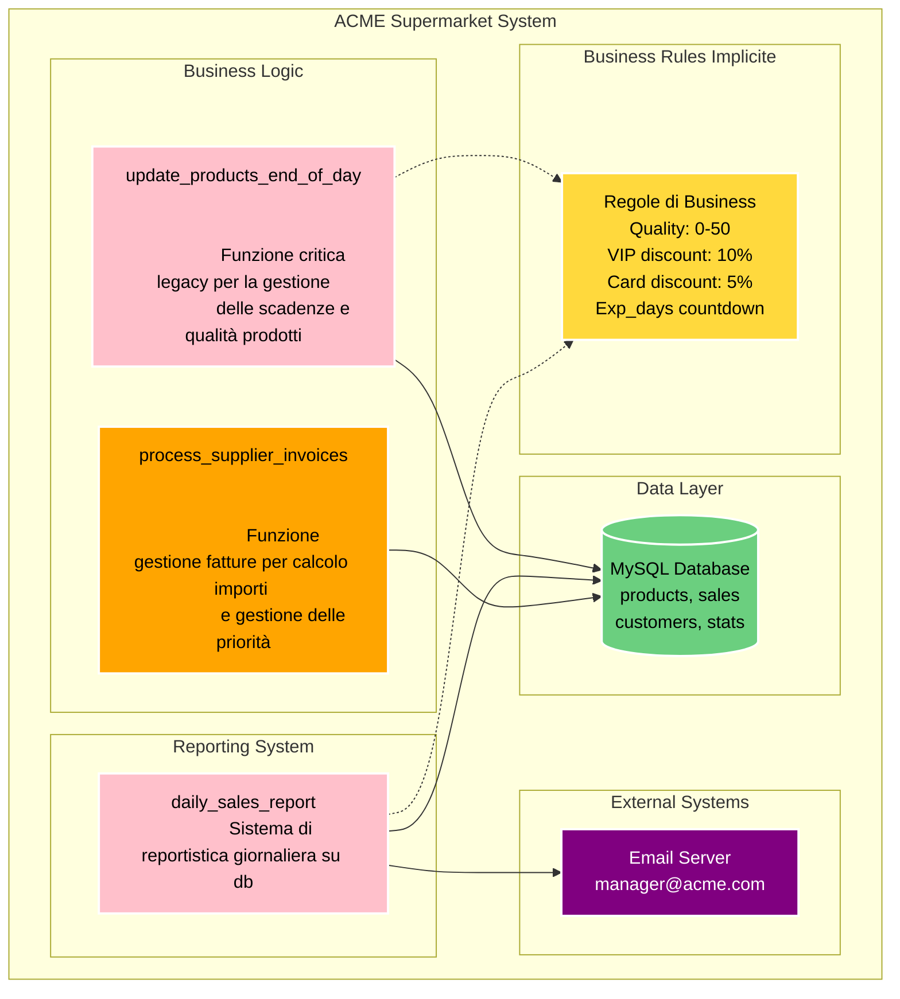

```mermaid
graph TB
    subgraph ACME["ACME Supermarket System"]
        subgraph CORE["Business Logic"]
            UPD["update_products_end_of_day<br/><br/>
                 Funzione critica legacy per la gestione
                 delle scadenze e qualità prodotti"]

            INV["process_supplier_invoices<br/><br/>
                 Funzione gestione fatture per calcolo importi 
                 e gestione delle priorità"]
        end
        subgraph REP["Reporting System"]
            DSR["daily_sales_report
            Sistema di reportistica giornaliera su db"]
        end
        
        subgraph DATA["Data Layer"]
            DB[("MySQL Database<br/>products, sales<br/>customers, stats")]
        end
        
        subgraph EXT["External Systems"]
            EMAIL["Email Server<br/>manager@acme.com"]
        end
        
        subgraph RULES["Business Rules Implicite"]
            BR["Regole di Business<br/>Quality: 0-50<br/>VIP discount: 10%<br/>Card discount: 5%<br/>Exp_days countdown"]
        end
    end
    
    UPD --> DB
    DSR --> DB
    INV --> DB
    DSR --> EMAIL
    
    UPD -.-> BR
    DSR -.-> BR
    
    style UPD fill:pink,stroke:#fff,stroke-width:2px,color:black
    style INV fill:orange,stroke:#fff,stroke-width:2px,color:black
    style DSR fill:pink,stroke:#fff,stroke-width:2px,color:black
    style BR fill:#ffd93d,stroke:#fff,stroke-width:2px,color:#000
    style DB fill:#6bcf7f,stroke:#fff,stroke-width:2px,color:#000
    style EMAIL fill:purple,stroke:#fff,stroke-width:2px,color:white

```