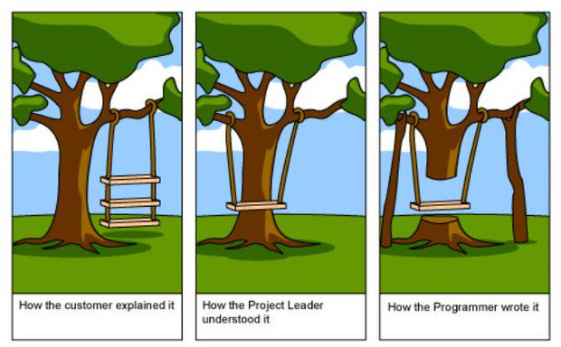
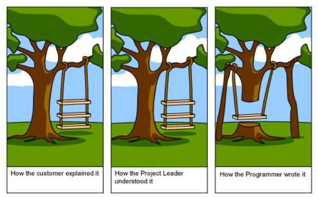

27 Novembre 2025 - Impact Hub, Firenze
<!-- .element: class="negative fs-06" -->

# Parlare la stessa lingua

## scrivere requisiti che diventano software


`Lorenzo Bugli`  \
Senior software engineer presso `Fiscozen` \
Membro community di `Schrödinger Hat` 
<!-- .element: class="fs-06" -->

---

#  🧑🏻‍💼
<!-- .element class="utf8-icon" -->

Questo e' `Bob`

---

#  🧑🏻‍💼
<!-- .element class="utf8-icon" -->

Bob è un `project manager` che \
ha ricevuto una richiesta dal `cliente` \
per una `nuova funzionalità`

---

Bob scrive le `specifiche` e le passa \
al team di `sviluppo` che inizia a lavorarci

---

Dopo `3 settimane` \
arriva la demo

---

# 🤦🏻
<!-- .element class="utf8-icon" -->

"Ma non era questo che intendevo!"

---

- Gli sviluppatori sono `confusi`
<!-- .element class="fragment" -->

- I rilasci si `bloccano`
<!-- .element class="fragment" -->

- Il cliente e' `scontento`
<!-- .element class="fragment" -->

---

# 🙍🏻
<!-- .element class="utf8-icon" -->
"Quegli sviluppatori \
non capiscono mai quello che \
chiedo!"

---

# 🧑🏻‍💼
<!-- .element class="utf8-icon" -->
"Faro' degli `schemi semplici` per farmi capire meglio!"

---

# 🧑🏻‍💼 🪧 🧑🏻‍💻👩🏽‍💻👨🏼‍💻
<!-- .element class="utf8-icon" -->

Bob inizia ad organizzare \
`meeting` con il `team di sviluppo`

---

# 🧑🏻‍💼 🪧 🙋🏻🙋🏽‍♀️🙋🏼‍♂️
<!-- .element class="utf8-icon" -->
Il team lo bombarda di domande \
perche' non capiscono 

---

- Le `stime` diventano `inaffidabili`
<!-- .element class="fragment" -->

- I rilasci `slittano`
<!-- .element class="fragment" -->

- Di nuovo, il cliente e' `scontento`
<!-- .element class="fragment" -->

---


<!-- .element: class="w-100" -->

---

Serve un modo per scrivere requisiti che:

- Abbiano un formato \
  `comprensibile` a tutti
<!-- .element: class="fragment" -->

- Non lascino spazio a \
  `interpretazioni`
<!-- .element: class="fragment" -->

- Stimolino le `domande giuste`
<!-- .element: class="fragment" -->

---

Questa e' la storia di come la \
`Gherkin syntax` ha aiutato `Bob`

---

# 👨🏻‍💼
<!-- .element class="utf8-icon" -->
`Mario` e' un imprenditore e vuole \
un `software` per la sua azienda

---

# 👨🏻‍💼 🧑🏻‍💼
<!-- .element class="utf8-icon" -->

`Mario` commissiona un \
software a `Bob` ed il suo team

---

# 👨🏻‍💼 💬 🧑🏻‍💼
<!-- .element class="utf8-icon" -->
`Bob` parla con `Mario` \
per raccogliere le informazioni

---

# 📑
<!-- .element class="utf8-icon" -->

Il software richiesto e' un `documentale` \
per la gestione dei documenti aziendali

---

Tra le tante specifiche \
c'e' anche la `gestione dei colori` \
per identificare meglio i documenti

---

# 🧑🏻‍💼 📝
<!-- .element class="utf8-icon" -->

Bob scrive i `requisiti` \
da passare al team di sviluppo

---

```text[|1-2|3-5|6-9]
Il sistema deve associare a tutti i documenti firmati 
digitalmente il colore verde.  

Tutti i documenti di tipo distinte materiale devono 
essere associati al colore giallo.  

I documenti in lavorazione devono essere associati al 
colore rosso a meno che non siano di tipo disegno tecnico, 
in quel caso devono avere il colore blu.
```

---

Sono dei requisiti chiari?

---


# 🧑🏻‍💼 📝
<!-- .element class="utf8-icon" -->

- frasi in italiano corretto
<!-- .element: class="fragment" -->

- indicano condizioni e risultati
<!-- .element: class="fragment" -->

- usano termini comuni
<!-- .element: class="fragment" -->

---

# 🧑🏻‍💻
<!-- .element class="utf8-icon" -->

Se li guardiamo con gli occhi \
di uno sviluppatore 

---

# 🧑🏻‍💻
<!-- .element class="utf8-icon" -->

```text[]
Il sistema deve associare a tutti i documenti firmati 
digitalmente il colore verde.  

Tutti i documenti di tipo distinte materiale devono 
essere associati al colore giallo.  

I documenti in lavorazione devono essere associati al 
colore rosso a meno che non siano di tipo disegno tecnico, 
in quel caso devono avere il colore blu.
```

```[]
Documento:
  - stato: str # es. in lavorazione, firmato digitalmente, ...
  - tipo: str # es. distinta materiale, disegno tecnico, ...
  - is_firmato_digitalmente: bool # true/false 
```
<!-- .element class="fs-08 fragment" -->

---

# 🧑🏻‍💻
<!-- .element class="utf8-icon" -->
```text[]
Il sistema deve associare a tutti i documenti firmati 
digitalmente il colore verde.  

Tutti i documenti di tipo distinte materiale devono 
essere associati al colore giallo.  

I documenti in lavorazione devono essere associati al 
colore rosso a meno che non siano di tipo disegno tecnico, 
in quel caso devono avere il colore blu.
```

<br/>

"Di che `colore` sono le \
`distinte materiale` in `lavorazione`?"

---

# 🧑🏻‍💻
<!-- .element class="utf8-icon" -->
```text[]
Il sistema deve associare a tutti i documenti firmati 
digitalmente il colore verde.  

Tutti i documenti di tipo distinte materiale devono 
essere associati al colore giallo.  

I documenti in lavorazione devono essere associati al 
colore rosso a meno che non siano di tipo disegno tecnico, 
in quel caso devono avere il colore blu.
```

<br/>

"Cosa succede per i `disegni tecnici`  `firmati digitalmente`?"

---

# 🧑🏻‍💻
<!-- .element class="utf8-icon" -->

- Specifica aperta ad `interpretazioni`
<!-- .element: class="fragment" -->

- Specifica manca di `precisione`
<!-- .element: class="fragment" -->

- Specifica non `esaustiva` per tutti i casi
<!-- .element: class="fragment" -->

---

Problema dell'interpretazione


---

Problema del telefono senza fili


---

# 🧑🏻‍💻
<!-- .element class="utf8-icon" -->
`Franco` e' uno dei programmatori Bob

---

# 🧑🏻‍💻 🧑🏻‍💼
<!-- .element class="utf8-icon" -->
Leggendo le specifiche di `Bob` gli chiese
di riportarle in un modo diverso

---

Gli chiese di scriverle in questa notazione

```gherkin[]
Dato [contesto iniziale]
Quando [azione dell'utente]
Allora [risultato atteso]
```
<!-- .element class="fs-15" -->

---

# 🧑🏻‍💻 🧑🏻‍💼
<!-- .element class="utf8-icon" -->
"Si chiama Gherkin syntax, provala!"

---

- Passaggio da linguaggio naturale a specifico per esempi
<!-- .element: class="fragment" -->

- Limitazione del lessico
<!-- .element: class="fragment" -->

- Vincolo di 1 solo caso per paragrafo
<!-- .element: class="fragment" -->

---


# 🧑🏻‍💻
<!-- .element class="utf8-icon" -->
"Se ci scrivi TUTTI i possibili casi in questo modo 
sono convinto che andremo meglio!"

---

# 🙍🏻
<!-- .element class="utf8-icon" -->
`Bob` e' scettico \
ma tanto vale provarci

---

```text[]
Il sistema deve associare a tutti i documenti firmati 
digitalmente il colore verde.  

Tutti i documenti di tipo distinte materiale devono 
essere associati al colore giallo.  

I documenti in lavorazione devono essere associati al 
colore rosso a meno che non siano di tipo disegno tecnico, 
in quel caso devono avere il colore blu.
```
<!-- .element class="fs-08" -->

---

```text[]
Il sistema deve associare a tutti i documenti firmati 
digitalmente il colore verde.  
```
<!-- .element class="fs-08" -->

```gherkin[|1|2|3|]
Dato un documento "firmato digitalmente"
Quando il sistema assegna un colore al documento
Allora il colore associato al documento e' il "verde"
```
<!-- .element class="fs-08" -->

---

```text[]
Tutti i documenti di tipo distinte materiale devono 
essere associati al colore giallo.  
```
<!-- .element class="fs-08" -->

```gherkin[|1|2|3|]
Dato un documento di tipo "distinta materiale"
Quando il sistema assegna un colore al documento
Allora il colore associato al documento e' il "giallo"
```
<!-- .element class="fs-08" -->

---

```text[]
I documenti in lavorazione devono essere associati al 
colore rosso a meno che non siano di tipo disegno tecnico, 
in quel caso devono avere il colore blu.
```
<!-- .element class="fs-08" -->

```gherkin[|1|2|3|5|6|7|8|9|]
Dato un documento in lavorazione NON di tipo "disegno tecnico"
Quando il sistema assegna un colore al documento
Allora il colore associato al documento e' il "rosso"

Dato un documento in lavorazione di tipo "disegno tecnico"
Quando il sistema assegna un colore al documento
Allora il colore associato al documento e' il "blu"
```
<!-- .element class="fs-08" -->

---

```gherkin[]
Dato un documento "firmato digitalmente"
Quando il sistema assegna un colore al documento
Allora il colore associato al documento e' il "verde"

Dato un documento di tipo "distinta materiale"
Quando il sistema assegna un colore al documento
Allora il colore associato al documento e' il "giallo"

Dato un documento in lavorazione NON di tipo "disegno tecnico"
Quando il sistema assegna un colore al documento
Allora il colore associato al documento e' il "rosso"

Dato un documento in lavorazione di tipo "disegno tecnico"
Quando il sistema assegna un colore al documento
Allora il colore associato al documento e' il "blu"
```
<!-- .element class="fs-06 h-25 hide-scrollbar" -->

---

# 🧑🏻‍💼
<!-- .element class="utf8-icon" -->

Bob legge i requisiti scritti in questo modo
e inizia a scriverne `un altro` per completare il quadro

---

```gherkin []
Dato un documento in lavorazione NON di tipo "disegno tecnico"
Quando il sistema assegna un colore al documento
Allora il colore associato al documento e' il "rosso"

Dato un documento in lavorazione di tipo "disegno tecnico"
Quando il sistema assegna un colore al documento
Allora il colore associato al documento e' il "blu"
```
<!-- .element class="fs-08" -->

```gherkin [|1|2|3|]
Dato un documento di tipo "disegno tecnico" NON in lavorazione
Quando il sistema assegna un colore al documento
Allora il colore associato al documento e' il  "????"
```
<!-- .element class="fs-08" -->

---

# 🧑🏻‍💼
<!-- .element class="utf8-icon" -->
"Come ho fatto a non accorgermi?"

---

Quando scrivi in linguaggio comune non ti accorgi delle `mancanze`
e delle eventuali `contraddizioni`

---

Legge una riga alla volta e va avanti reputandola corretta

---

# 🧑🏻‍💼
<!-- .element class="utf8-icon" -->
`Bob` continua a scrivere

---

- firmato + distinta materiali \
  → verde o giallo?
<!-- .element: class="fragment" -->

- firmato + in lavorazione \
  → verde o rosso?
<!-- .element: class="fragment" -->

- firmato + in lavorazione + disegno tecnico \
  → verde o blu?
<!-- .element: class="fragment" -->

---

La scrittura in `Gherkin syntax` \
ha aiutato `Bob` a localizzare dei casi \
non considerati prima

---

# 👨🏻‍💼 🧑🏻‍💼
<!-- .element class="utf8-icon" -->

`Bob` torna da `Mario` 
per chiedere chiarimenti sulle specifiche

---

# 👨🏻‍💼 📝 🧑🏻‍💼
<!-- .element class="utf8-icon" -->

`Mario` capisce subito quello che `Bob` \
ha scritto, fornisce subito le risposte 

---

Anche se risulta `meccanico` e `artificiale`
e' molto `efficace`

```gherkin []
Dato un documento di tipo "disegno tecnico" NON in lavorazione
Quando il sistema assegna un colore al documento
Allora il colore associato al documento e' il  "????"
```
<!-- .element class="fs-08" -->

---

- Grazie agli esempi concreti, `Mario` può dare risposte `precise`.

- Tutti i `comportamenti attesi` sono chiari e condivisi.
<!-- .element: class="fragment" -->

- I meeting sono `brevi` e non finiscono `fuori tema`
<!-- .element: class="fragment" -->

---



---

# 🧑🏻‍💼
<!-- .element class="utf8-icon" -->

`Bob` e' molto soddisfatto \
il rapporto con il cliente e' molto `facilitato`

---

# 🧑🏻‍💼
<!-- .element class="utf8-icon" -->

Tutti i dubbi si sono risolti 

---

# 🙎🏻
<!-- .element class="utf8-icon" -->

`Bob` e' comunque scettico verso gli sviluppatori

---

# 🙎🏻
<!-- .element class="utf8-icon" -->
"Speriamo che questo progetto \
non finisca male per l'ennesima volta!"

---

# 🧑🏻‍💻 🧑🏻‍💼
<!-- .element class="utf8-icon" -->

`Bob` torna da `Franco` 
per portargli le specifiche riscritte

---

# 🧑🏻‍💻
<!-- .element class="utf8-icon" -->

`Franco` finisce il lavoro in meta' tempo

e sopratutto `senza errori`
<!-- .element: class="fragment" -->

---


# La faccia di Bob


---

Ma come ha fatto?

---

Ha usato il \
`Test Driven Development (TDD)` \
per scrivere il codice

---

# Il Test Driven Development

<div class="left-col">
    
</div>
<div class="right-col">

- Prima si scrivono i `test`
<!-- .element: class="fragment" -->

- Poi si scrive il `codice`
<!-- .element: class="fragment" -->

</div>


---

Prima definisci \
`come deve comportarsi` il software, 

<br>

Solo dopo scrivi il codice che \
`soddisfa quei comportamenti`.
<!-- .element: class="fragment" -->

---

```gherkin[]
Given un documento firmato digitalmente
When il sistema assegna un colore al documento
Then il documento deve essere verde

Given un documento di tipo "distinta materiale"
When il sistema assegna un colore al documento
Then il documento deve essere giallo

Given un documento in lavorazione di tipo "disegno tecnico"
When il sistema assegna un colore al documento
Then il documento deve essere rosso

Given un documento in lavorazione di tipo "disegno tecnico"
When il sistema assegna un colore al documento
Then il documento deve essere blu
```
<!-- .element class="fs-08 h-35" -->

---

Ogni `specifica` diventa un `test`

---

```gherkin[]
Given documento di tipo distinta materiale non firmata digitalmente
When il sistema assegna un colore al documento
Then il colore associato è il GIALLO
```
```python [|5-12|13-15|17-19]
from behave import given, then, when
from document import Colori, Documento, StatoDocumento, TipoDocumento
from system import System

@given("documento di tipo distinta materiale non firmata digitalmente")
def given_documento_distinta_materiale_non_firmata_digitalmente(context):
    context.distinta = Documento(
        tipo=TipoDocumento.DISTINTA_MATERIALI,
        stato=StatoDocumento.INVIATO,
        firmato=False,
    )

@when("il sistema assegna un colore al documento")
def when_sistema_assegna_colore(context):
    System.assign_color(context.distinta)

@then("il colore associato è il GIALLO")
def then_colore_associato_is_yellow(context):
    assert context.distinta.colore == Colori.GIALLO
```
<!-- .element class="fs-06 hide-scrollbar" -->

---

```gherkin []
Given un documento in lavorazione di tipo "disegno tecnico"
When il sistema assegna un colore al documento
Then il documento deve essere BLU
```
```python [|5-11|13-15|17-19]
from behave import given, when, then
from document import Colori, Documento, StatoDocumento, TipoDocumento
from system import System

@given('un documento in lavorazione di tipo "disegno tecnico"')
def given_documento_in_lavorazione_disegno_tecnico(context):
    context.documento = Documento(
        tipo=TipoDocumento.DISEGNO_TECNICO,
        stato=StatoDocumento.LAVORAZIONE,
        firmato=False
    )

@when("il sistema assegna un colore al documento")
def when_sistema_assegna_colore(context):
    System.assign_color(context.documento)

@then("il documento deve essere blu")
def then_documento_deve_essere_blu(context):
    assert context.documento.colore == Colori.BLU
```
<!-- .element class="fs-06 hide-scrollbar" -->

---

Ogni `scenario` descrive \
un `comportamento specifico` \
senza ambiguità

---

# 🧑🏻‍💻 ➡️ 🤖
<!-- .element class="utf8-icon" -->

`Franco` ha fatto diventare tutti gli scenari 
dei `test automatici`

---

- `Bob` ha scritto tutti gli scenari \
  insieme allo `stakeholder`
<!-- .element: class="fragment" -->

- `Franco` ha creato il software a \
  partire dagli scenari di `Bob`
<!-- .element: class="fragment" -->

---

# 👨🏻‍💼 ➡️ 📝 ➡️ 🤖 ➡️ ✅
<!-- .element class="fs-20" -->
Cliente -> Requisiti -> Test -> Verifica

```gherkin []
Given un documento in lavorazione di tipo "disegno tecnico"
When il sistema assegna un colore al documento
Then il documento deve essere BLU
```

---

- `Comunicazione` chiara tra tutti
<!-- .element: class="fragment" -->

- `Verifica` automatica dei requisiti
<!-- .element: class="fragment" -->

- Meno `ambiguità` e `malintesi`
<!-- .element: class="fragment" -->

---

Tutti parlano la `stessa lingua`

la `Gherkin syntax`
<!-- .element class="fragment" -->

---


# 1️⃣ Requisiti chiari

Scritti in un linguaggio \
comprensibile a tutti

---

# 2️⃣ Test verificabili

Che traducono i requisiti \
in verifiche automatiche

---

# 3️⃣ Sviluppo guidato

Gli sviluppatori sanno \
esattamente cosa implementare

---

# 4️⃣ Validazione continua

I test verificano che il codice \
rispetti i requisiti

---

Con questo approccio tutti vincono:

- Il `business` ha requisiti chiari
<!-- .element: class="fragment" -->

- Gli `sviluppatori` sanno cosa fare
<!-- .element: class="fragment" -->

- I `test` verificano automaticamente
<!-- .element: class="fragment" -->

- Il `cliente` ottiene ciò che vuole
<!-- .element: class="fragment" -->

---


---

# 🧑🏻‍💼
<!-- .element class="utf8-icon" -->

Ogni mattina `Bob` si sveglia

---

# 🧑🏻‍💼
<!-- .element class="utf8-icon" -->

Bob scrive `specifiche` \
tramite la `Gherkin syntax`

---

# 🧑🏻‍💻
<!-- .element class="utf8-icon" -->

Ogni mattina `Franco` si sveglia 

---

# 👩🏻‍💼
<!-- .element class="utf8-icon" -->

`Franco` sa che puo' lavorare \
trasformando i `requisiti` di `Bob` \
in `test` per i software

---

- Le `stime` sono `affidabili`
<!-- .element: class="fragment" -->

- I rilasci sono `nei tempi`
<!-- .element: class="fragment" -->

- Il cliente e' `soddisfatto`
<!-- .element: class="fragment" -->

---

# 🧑🏻‍💼 🧑🏻‍💻
<!-- .element class="utf8-icon" -->

Che tu sia `Bob` oppure `Franco` \
l'importante è che tu sappia comunicare \
con `Gherkin` per lavorare meglio 

---

27 Novembre 2025 - Impact Hub, Firenze
<!-- .element: class="negative fs-06" -->

# Grazie!


`Lorenzo Bugli`  \
Senior software engineer presso `Fiscozen` \
Membro community di `Schrödinger Hat` 
<!-- .element: class="fs-06" -->

---

Riferimenti 


[https://cucumber.io/](https://cucumber.io/)


