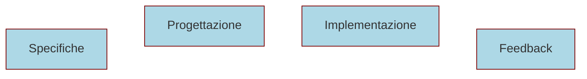
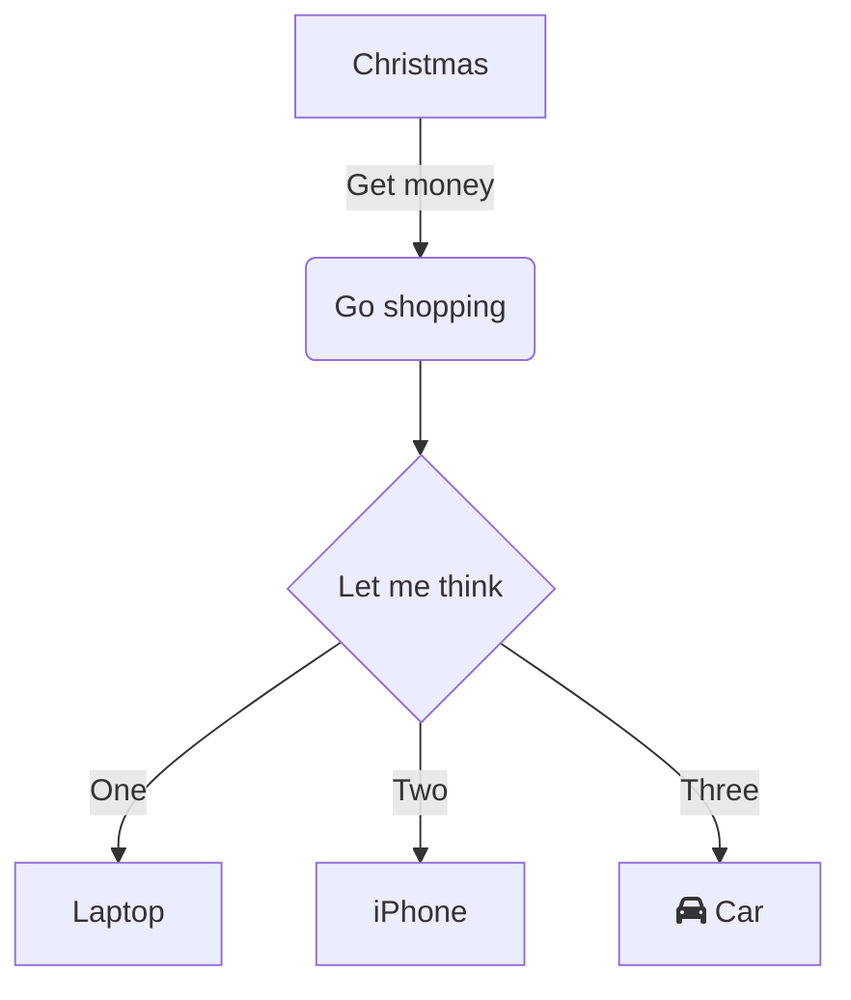

## Sviluppare un software


---



---

```mermaid-animation
A
A-->B B 
B-->C C
C-->D D C-->E E C-->F F
```
---

## Problemi nello sviluppo software 

Specifiche errate o incomplete
<!-- .element: class="fragment" -->

Cattiva comunicazione con gli stakeholder
<!-- .element: class="fragment" -->

---

<div class="sources">

### Fonti 

- [Wikipedia - Stakeholder](https://it.wikipedia.org/wiki/Stakeholder)
- [Zero uno web](https://www.zerounoweb.it/software/gli-stakeholder-e-il-loro-punto-di-vista/)


### Libri
<!-- .element: class="mt-1" -->

- [ATDD by Example: A Practical Guide to Acceptance Test-Driven Development](https://www.amazon.it/ATDD-Example-Practical-Acceptance-Test-Driven/dp/0321784154)

</div>
